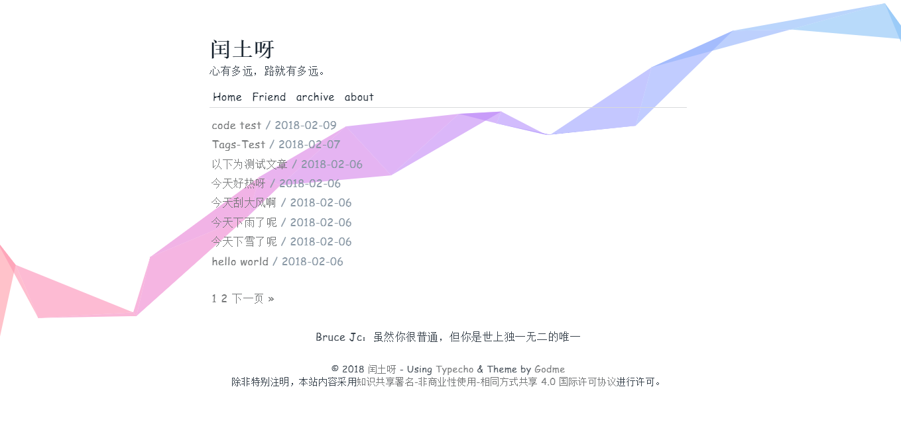

# Plain

## Theme for Typecho.
## 极简主题，专注于创作。

### 创建归档

1. 创建独立页面。
2. 选择自定义模板 ```recent```，标题为 ```归档```。
3. 发布。

### 网站头像

- 直接替换目录的 favicon.ico 。

### 抖动提醒

- 更改外观 -> 设置外观 -> 填写内容。

### 友链示例

- 新建独立页面,标题为 ```友链```，内容参照以下格式。

```markdown
- [Google](https://Google.com)
- [Godme: 无非是一个不可知的背负](https://www.runtua.cn)
```
如果需要添加友链头像，**[] 内必须为 friend**

### pjax

- **需要关闭反垃圾保护**，不然会导致无法评论。
- 设置 -> 评论 -> 取消勾选反垃圾保护。

### 欢迎提 issue 。
