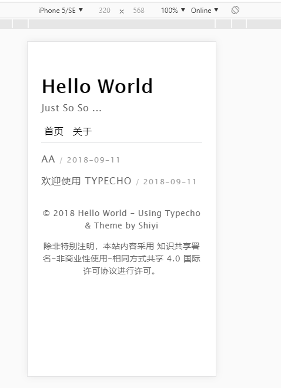

## Theme for Typecho.


[](https://runtua.cn.com)


思于心现于形，极简主题，专注于创作。

ui from **[ikirby](https://ikirby.me/)**

# 目录

- [注意事项](#注意事项)
- [主题介绍](主题介绍)
- [主题设置](#主题设置)
- [License](#license)

## 注意事项

- **需要关闭反垃圾保护**，不然会导致无法评论。  
  -> 设置 -> 评论 -> 取消勾选反垃圾保护。

## 主题介绍



## 使用方法

1.  Clone or download.
2.  上传 **Plan 文件夹** 到 `usr/themes/` 目录下。
3.  在 `Typecho` 后台，主题设置应用即可 ~
4.  主题设置勾选必选项并填入相关信息。/滑稽。

## 主题设置

#### 归档

1.  创建独立页面。
2.  选择自定义模板 `Recent`，标题自拟，`Recent / 归档`。
3.  发布。

### 友链

- 新建独立页面，标题自拟，如`友链`，内容参照以下格式。

### 网站图标

- 主题设置填入 `ico` 链接地址。( 建议为 `ico` 格式)

### 社交链接

- 主题设置内填入完整链接地址。

```markdown
# 无图友链

- [Google](https://Google.com)

# 带图友链，[] 内必须为 friend

- [Godme: 无非是一个不可知的背负](https://www.runtua.cn)
```

#### 背景图

- 主题设置 => 填入完整 url

#### 一言

- [Hitokoto - 一言](https://hitokoto.cn/)

#### 代码高亮

[Prism](http://prismjs.com)：prism.js tomorrow night eighties for JavaScript, CoffeeScript, CSS and HTML

#### 类彩带

- 手机端默认不显示

#### 站龄

- 格式如下：

- 2017/11/02 11:31:29

## License


